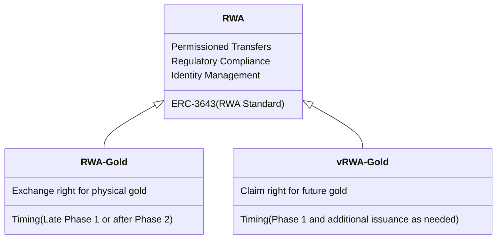

### RWA Overview

**RWA (Real World Asset)** is a tangible or intangible asset that exists outside the digital realm but is transferred to the blockchain through a process called **tokenization**. At its core, RWA serves to bridge **the gap between Traditional Finance (TradFi) and Decentralized Finance (DeFi)**.

:::tip[What is RWA (Real World Asset)?]
**RWA** can be broadly classified as follows:

- Tangible Assets:
    - Real Estate: Residential properties, commercial buildings, land
    - Commodities: **Gold, silver, oil**, agricultural products
    - Collectibles: Art pieces, luxury goods, rare wines, classic cars
    - Infrastructure: Solar power plants, telecommunication towers
- Intangible Assets (Financial and Legal):
    - Bonds: Government bonds (e.g., U.S. Treasury bonds), corporate bonds
    - Stocks: Listed or unlisted company shares
    - Credit: Private credit, loans
    - Intellectual Property Rights: Patents, copyrights, trademarks
    - Carbon Credits: Environmental assets representing carbon emission reductions
:::

### KASH Project RWA Structure

The KASH project primarily utilizes **RWA(Gold)**, which tokenizes physical gold, and **vRWA(Gold)**, which tokenizes future claims to gold.

Both **RWA(Gold)** and **vRWA(Gold)** are designed to comply with **RWA's standard technical specification (ERC-3643)**.

:::tip[Phase 1 RWA Strategy]
While **vRWA** is designed to comply with the **ERC-3643 standard as an RWA**, it faces fewer restrictions. This is because **in Phase 1, it is only used as collateral for KASH tokens** and is not directly exposed to investors, meaning no transfers occur between investors.
:::

The core principles of the RWA standard technical specification ERC-3643 are as follows:

- **Permissioned Transfers**: This is the most crucial feature. ERC-3643 tokens can only be held and transferred by pre-approved and verified wallets. This "permission" ensures that only qualified investors or entities can participate in the token ecosystem.
- **Compliance-First Design**: It is designed with regulatory compliance in mind from the start. This means that legal and regulatory requirements are enforced at the protocol level rather than being external considerations.
- **On-chain Identity Management - ONCHAINID**: ERC-3643 integrates a decentralized identity framework often called ONCHAINID.

:::tip[On-chain Identity Management]
Each user has a unique and globally accessible identity on the blockchain.

This identity is linked to "claims" or "verifiable credentials" issued by trusted entities (claim issuers). These claims verify specific user attributes such as KYC/AML verification status, accredited investor status, or residence in specific jurisdictions.

When a token transfer is initiated, the ERC-3643 smart contract verifies the ONCHAINID status of both sender and receiver to ensure they meet predefined eligibility and compliance rules.

Sensitive personal data is typically stored off-chain, with only cryptographic hashes or signatures stored on-chain to maintain privacy while allowing verification.
:::

### Comparison between vRWA and RWA

vRWA is **directly deposited into the KASH Reserve Pool and used as collateral for KASH issuance**,
and as liquidation progresses, this collateral is gradually replaced with **virtual assets or physical RWA(Gold)**.

Consequently, the asset composition within the reserve pool transitions from **vRWA → stablecoin/gold RWA** over time,
and vRWA **completely liquidates and disappears from the reserve pool by maturity (3 years after liquidation)**.

| **Item** | **vRWA (Phase 1)** | **RWA(Gold) (Phase 2 and beyond)** |
| --- | --- | --- |
| **Physical Asset Linkage** | Claim right form, future realization expected | Based on direct physical gold holdings |
| **Collateral Nature** | Promised exchange right (physical RWA or equivalent value in virtual assets) | Direct collateral based on physical assets |
| **KASH Reserve Pool Integration** | ✅ **vRWA directly deposited and functions as KASH issuance collateral** | ✅ RWA(Gold) directly deposited and serves as KASH collateral |
| **Asset Conversion Structure** | Converts to virtual assets or RWA through liquidation → Reserve pool asset composition change | Continuous holding and manageable according to foundation policy |
| **Distribution Method** | Limited period, maturity-based liquidation structure | Continuous circulation, expandable based on PoR |

vRWA is a **transitional RWA that serves as a bridge toward gold RWA**.

Through this, the KASH project can **secure time to establish physical asset-based value** while stably designing initial liquidity and participant rewards.

:::tip[Technical Specifications and Transparency Assurance]

- **ERC-3643 based RWA Standard Usage**
    - Token standard capable of permission management and AML/KYC compliance
    - Includes transfer restriction and identification structure for regulatory compliance
- **Smart Contract Liquidation Logic Implementation**
    - Automatic execution structure for vRWA maturity management and partial liquidation
:::

<!-- ---
id: rwa-overview
title: 1. KASH 프로젝트 RWA 개요
description: RWA & vRWA 개요 및 비교
sidebar_position: 1
---

### RWA 개요

**RWA (Real World Asset)** 은 디지털 영역 밖에 존재하지만, **토큰화**라는 과정을 통해 블록체인으로 옮겨지는 유형 또는 무형의 자산입니다. 본질적으로 RWA는 **전통 금융(TradFi)과 탈중앙화 금융(DeFi) 사이의 간극**을 연결합니다.

:::tip[RWA (Real World Asset)란 무엇인가요?]
**RWA**는 크게 다음과 같이 분류할 수 있습니다:

- 유형 자산:
    - 부동산: 주거용 부동산, 상업용 건물, 토지
    - 상품: **금, 은, 석유**, 농산물
    - 수집품: 미술품, 명품, 희귀 와인, 클래식 자동차
    - 인프라: 태양광 발전소, 통신 타워
- 무형 자산 (금융 및 법률):
    - 채권: 국채(미국 국채 등), 회사채
    - 주식: 상장 또는 비상장 기업의 주식
    - 신용: 사모 신용, 대출
    - 지적 재산권: 특허, 저작권, 상표
    - 탄소 배출권: 탄소 배출 감소를 나타내는 환경 자산
:::

### KASH 프로젝트 RWA 구조

KASH 프로젝트에서는 **실물 금을 토큰화한 RWA(Gold)** 와 **미래 금에 대한 청구권을 토큰화한 vRWA(Gold)** 를 우선적으로 사용합니다.

**RWA(Gold)** 와 **vRWA(Gold)** 모두 **RWA의 표준 기술 스펙(ERC-3643)** 을 준수하도록 설계됩니다.

:::tip[1기 RWA 전략]
**vRWA**는 **RWA로서의 ERC-3643 표준**을 준수하도록 설계되지만 제약을 크게 받지는 않습니다. 이유는 **1기에는 KASH 토큰 담보로만 사용되어** 투자자에게 직접적으로 노출되지 않아 투자자간 전송이 발생하지 않기 때문입니다.
:::

~~~mermaid
classDiagram
    RWA <|-- RWA-Gold
    RWA <|-- vRWA-Gold
    RWA : ERC-3643(RWA 표준)
    RWA : Permissioned Transfers
    RWA : Regulatory Compliance
    RWA : Identity Management
    RWA-Gold : 실물 금에 대한 교환권
    RWA-Gold : 시기(1기 후반 혹은 2기 이후)
    vRWA-Gold : 미래 금에 대한 청구권
    vRWA-Gold : 시기(1기 그리고 필요에 따라 추가 발행)
~~~

RWA 표준 기술 스펙인 ERC-3643의 핵심 원칙은 다음과 같습니다.

- **허가형 전송 (Permissioned Transfers)**: 가장 핵심적인 특징입니다. ERC-3643 토큰은 사전 승인 및 검증된 지갑만 보유하고 전송할 수 있습니다. 이러한 "허가"는 적격한 투자자 또는 법인만이 토큰 생태계에 참여할 수 있도록 보장합니다.

- **컴플라이언스 우선 설계 (Compliance-First Design)**: 규제 준수를 염두에 두고 처음부터 설계되었습니다. 이는 법률 및 규제 요구 사항이 외부적인 고려 사항이 아니라 프로토콜 수준에서 시행됨을 의미합니다.

- **온체인 신원 관리 (On-chain Identity Management - ONCHAINID)**: ERC-3643은 종종 ONCHAINID라고 불리는 분산형 신원 프레임워크를 통합합니다.

:::tip[온체인 신원 관리]
각 사용자는 블록체인 상에 고유하고 전역적으로 접근 가능한 신원을 가집니다.

이 신원은 신뢰할 수 있는 주체(클레임 발행자)가 발행하는 "클레임" 또는 "검증 가능한 자격 증명"에 연결됩니다. 이 클레임은 KYC/AML 검사 통과 여부, 공인 투자자 여부, 특정 관할 구역 거주 여부 등 사용자의 특정 속성을 증명합니다.

토큰 전송이 시작되면, ERC-3643 스마트 계약은 송신자와 수신자 모두의 ONCHAINID 상태를 확인하여 미리 정의된 적격성 및 규정 준수 규칙을 충족하는지 확인합니다.

민감한 개인 데이터는 일반적으로 오프체인에 저장되며, 개인 정보 보호를 유지하면서 검증을 허용하기 위해 암호화 해시 또는 서명만 온체인에 저장됩니다.
:::

### vRWA와 RWA의 비교

vRWA는 **KASH 리저브풀에 직접 예치되어 KASH 발행의 담보로 사용되며**,
이후 청산이 진행됨에 따라 해당 담보는 **가상자산 혹은 실물 RWA(Gold)** 로 단계적으로 대체됩니다.

결과적으로 리저브풀 내 자산 구성은 시간이 지남에 따라 **vRWA → 스테이블코인/금 RWA로 전환**되며,
vRWA는 **만기(청산 이후 3년) 시점까지 완전히 청산되어 리저브풀에서 소멸**됩니다.

| **항목** | **vRWA (1기)** | **RWA(Gold) (2기 이후)** |
| --- | --- | --- |
| **실물 연동 방식** | 청구권 형태, 미래 실현 예정 | 실물 금 직접 보유에 기반 |
| **담보 성격** | 약속된 교환권 (실물 RWA 또는 동등 가치의 가상자산) | 실물 기반 직접 담보 |
| **KASH 리저브풀 내 편입** | ✅ **vRWA가 직접 예치되어 KASH 발행의 담보로 작동** | ✅ RWA(Gold)가 직접 예치되어 KASH 담보 역할 |
| **자산 전환 구조** | 청산되며 가상자산 또는 RWA로 전환 → 리저브풀 구성 자산 교체 | 지속 보유 및 재단 정책에 따라 관리 가능 |
| **유통 방식** | 제한된 기간, 만기형 청산 구조 | 지속 유통, PoR 기반 확장 가능 |

vRWA는 **금 RWA를 향한 가교 역할을 수행하는 전환형 RWA**입니다.

이를 통해 KASH 프로젝트는 **실물 기반 가치 정립을 위한 시간을 확보하면서도**, 초기 유동성과 참여자 보상을 안정적으로 설계할 수 있습니다.

:::tip[기술 사양 및 투명성 확보]
- **ERC-3643 기반 RWA 표준 사용**
    - 권한 관리 및 AML/KYC 대응 가능한 토큰 표준
    - 규제 대응이 가능하고 전송 제한 및 식별 구조 내장
    
- **스마트컨트랙트 청산 로직 탑재**
    - vRWA의 만기 관리 및 분할 청산 자동 실행 구조
:::
 -->
